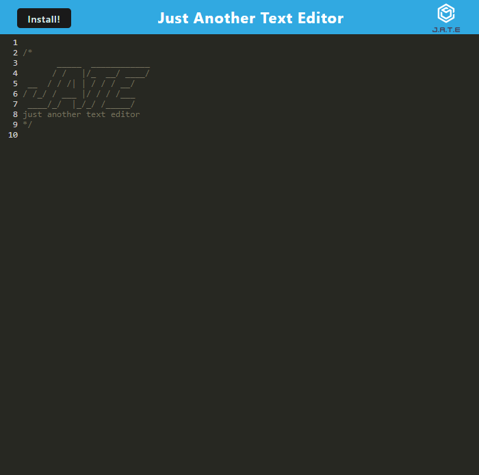

# PWA-Text-Editor

## Table of Contents

1. [Description](#Description)
1. [Installation](#Installation)
1. [Deployed Instance](#Deployed)
1. [Questions](#Questions)

## Description

This is a mock pwa text editor.

## Installation

Clone the repository and run `npm install` inside of its directory.
Run `npm build` to build the webpack.
Run `npm start` to start the application.

## Deployed Instance

This [link](https://serene-tor-34974.herokuapp.com/) will take you to a deployed application.

## Questions

Github Account: [rrrbbbsss](https://github.com/rrrbbbsss)
